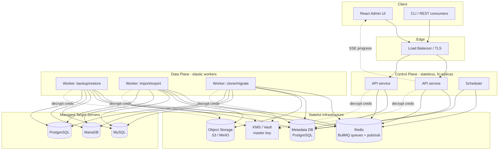
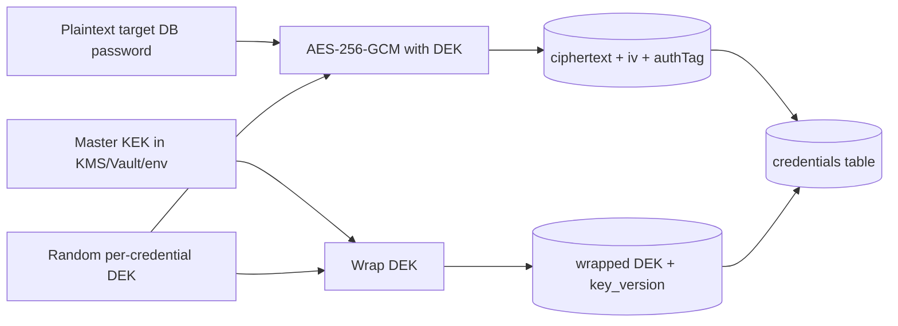
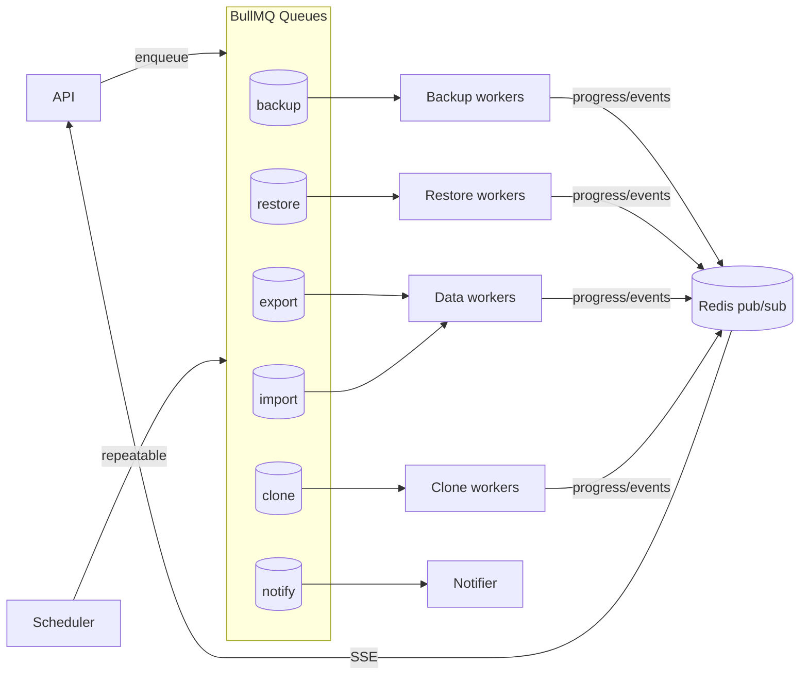
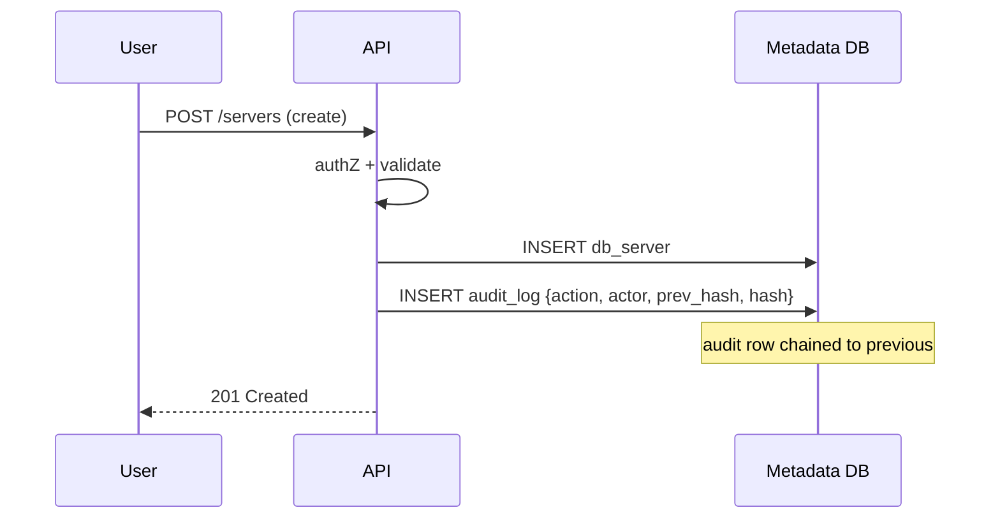
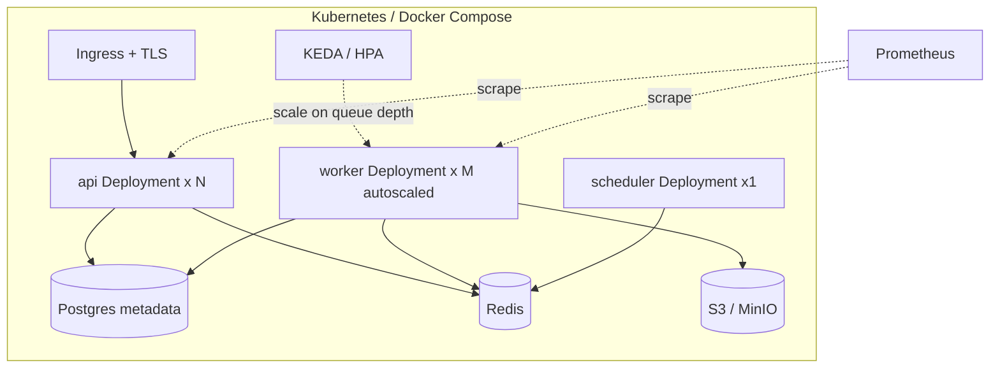
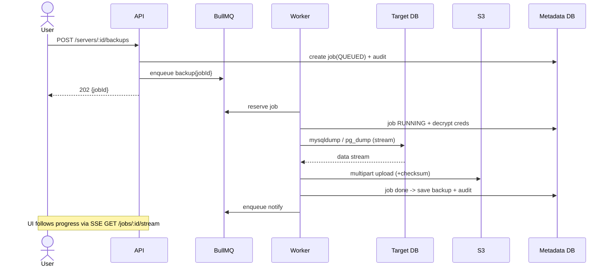
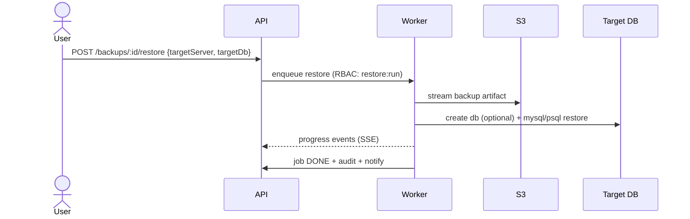
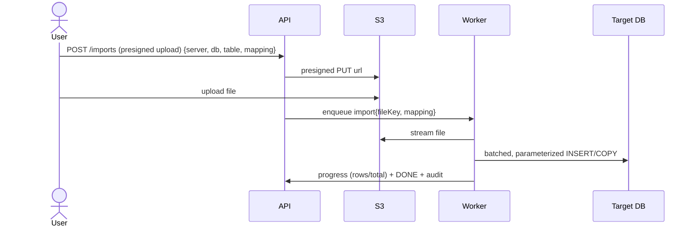
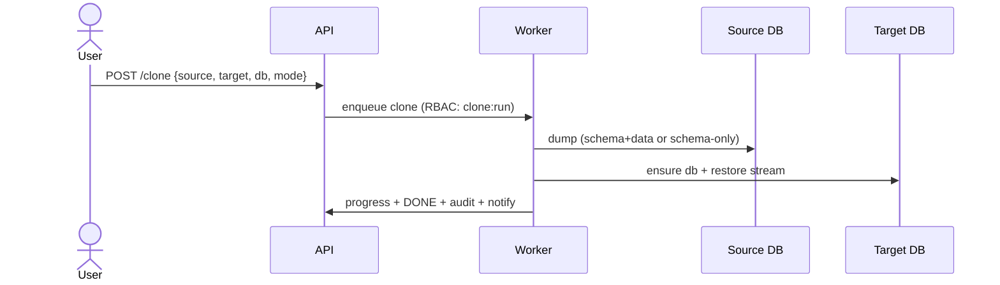

# Enterprise Database Backup / Restore / Import / Export Platform — Architecture

> Status: v1 design + reference implementation. This document is the source of truth for the
> system design. The codebase in this repository implements the core of this architecture.

## 0. Goals & Non‑Goals

**Goals**
- Manage **many** database servers (MySQL, MariaDB, PostgreSQL) from one control plane.
- First‑class operations: **Backup, Restore, Export (tables → CSV/Excel/SQL), Import (CSV/Excel), Clone, Migrate**.
- **Scheduled** backups, **audited** actions, **multi‑user** with **RBAC**, **JWT** auth.
- **Secure credential storage** (envelope encryption), **background job processing**, **progress tracking**, **notifications**, **S3** storage.
- **Horizontally scalable**, **multi‑tenant**, **Docker**-deployable, **production‑ready**.

**Non‑Goals (v1)**
- Logical replication / CDC streaming (future).
- Query editor / data browser beyond export (future).
- Managing the platform's own metadata DB lifecycle (operator/cloud responsibility).

---

## 1. High‑Level Architecture

The platform is split into a **stateless control plane** (API) and an **elastic data plane**
(workers). They communicate only through a **durable queue** and a shared **metadata DB**.
Heavy data never flows through the API — workers stream directly between target DBs and object storage.



**Key properties**
- **API is stateless** → scale horizontally behind a load balancer; sticky sessions not required (JWT).
- **Workers are stateless & elastic** → scale per queue based on backlog (KEDA / HPA on queue depth).
- **Data plane isolation** → a 200 GB restore never touches the API process memory or request path.
- **Single source of truth** = Metadata DB; Redis is the transport, not the system of record.

---

## 2. Database Schema (Metadata DB)

Every tenant‑scoped row carries `tenant_id`. Row‑level isolation is enforced in the data‑access
layer (and can be hardened with Postgres RLS). See `prisma/schema.prisma` for the canonical schema.

```mermaid
erDiagram
    TENANT ||--o{ USER : has
    TENANT ||--o{ DB_SERVER : owns
    TENANT ||--o{ JOB : owns
    TENANT ||--o{ AUDIT_LOG : records
    USER ||--o{ ROLE_ASSIGNMENT : has
    ROLE ||--o{ ROLE_ASSIGNMENT : grants
    ROLE ||--o{ ROLE_PERMISSION : includes
    PERMISSION ||--o{ ROLE_PERMISSION : in
    DB_SERVER ||--o{ CREDENTIAL : secured_by
    DB_SERVER ||--o{ BACKUP : produces
    DB_SERVER ||--o{ SCHEDULE : scheduled_by
    SCHEDULE ||--o{ JOB : triggers
    JOB ||--o{ JOB_EVENT : emits
    JOB ||--o| BACKUP : creates
    BACKUP ||--o{ RESTORE : restored_as
    USER ||--o{ NOTIFICATION : receives

    TENANT { uuid id PK; string name; string slug; enum status; jsonb settings }
    USER { uuid id PK; uuid tenant_id FK; string email; string password_hash; bool mfa_enabled; enum status }
    ROLE { uuid id PK; uuid tenant_id FK; string name; bool is_system }
    PERMISSION { string key PK; string description }
    DB_SERVER { uuid id PK; uuid tenant_id FK; enum engine; string host; int port; enum ssl_mode }
    CREDENTIAL { uuid id PK; uuid server_id FK; string username; bytea ciphertext; bytea dek_wrapped; string iv; string key_version }
    JOB { uuid id PK; uuid tenant_id FK; enum type; enum status; int progress; jsonb params; uuid actor_id }
    BACKUP { uuid id PK; uuid tenant_id FK; uuid server_id FK; string database; enum format; bigint size; string storage_uri; string checksum }
    SCHEDULE { uuid id PK; uuid tenant_id FK; uuid server_id FK; string cron; enum type; bool enabled; int retention }
    AUDIT_LOG { uuid id PK; uuid tenant_id FK; uuid actor_id; string action; string target; jsonb meta; string hash; string prev_hash }
    NOTIFICATION { uuid id PK; uuid user_id FK; enum channel; string subject; enum status }
```

Core tables: `tenants, users, roles, permissions, role_permissions, role_assignments,
db_servers, credentials, jobs, job_events, backups, restores, schedules, audit_logs,
notifications, api_keys`.

---

## 3. Service Breakdown

| Service | Responsibility | State | Scaling signal |
|---|---|---|---|
| **API** | REST API, authN/authZ, validation, enqueue jobs, SSE progress, CRUD | stateless | RPS / CPU |
| **Worker** | Execute jobs: backup/restore/export/import/clone via DB adapters, stream to S3, emit progress + audit | stateless | queue depth |
| **Scheduler** | Materialize `schedules` into BullMQ repeatable jobs, enforce retention | leader‑elected singleton | n/a |
| **Notifier** | Consume notification events → email/webhook/Slack | stateless | queue depth |

All four ship from **one image**, selected by entrypoint (`server.js` / `worker.js` /
`scheduler.js`). This keeps build/CI simple while allowing **independent scaling** per role.

**Internal module boundaries** (within the codebase):
`auth`, `rbac`, `tenancy`, `servers`, `credentials (crypto)`, `backups`, `restore`, `export`,
`import`, `clone`, `schedules`, `jobs`, `queue`, `storage`, `audit`, `notifications`, `db/adapters`.

---

## 4. Security Architecture

**AuthN** — JWT access tokens (short‑lived, 15 min) + rotating refresh tokens (httpOnly, 7 d).
Passwords hashed with bcrypt (cost 12). Optional API keys (hashed at rest) for automation.

**AuthZ** — RBAC. `Permission` keys like `server:create`, `backup:run`, `restore:run`,
`user:manage`, `audit:read`. Roles bundle permissions; `role_assignments` bind users→roles within a
tenant. Every request resolves `(tenant, user, permissions)` and routes are guarded by
`requirePermission(...)`. Default roles: **Owner, Admin, Operator, Viewer**.

**Credential storage (envelope encryption)**

- Per‑credential **Data Encryption Key (DEK)**, wrapped by a **Key Encryption Key (KEK)** held
  outside the DB. `key_version` enables rotation without re‑reading plaintext.
- Plaintext exists only transiently in worker memory while a `pg_dump`/`mysqldump` runs; never
  logged, never returned by the API.

**Transport** — TLS everywhere; target connections use `ssl_mode` (disable/require/verify‑full).
**Hardening** — Helmet, CORS allowlist, rate limiting, Zod input validation, parameterized queries,
no shell string interpolation (args arrays only), least‑privilege DB roles recommended per target.
**Tenant isolation** — `tenant_id` filter enforced centrally; cross‑tenant access is impossible
through the data‑access layer.

---

## 5. Queue Architecture

BullMQ on Redis. One queue per job class so each scales and fails independently.



- **At‑least‑once** delivery; jobs are **idempotent** (keyed by `jobId`; artifacts content‑addressed).
- **Retries** with exponential backoff; poison jobs land in a **dead‑letter** set for inspection.
- **Concurrency** tuned per worker; long jobs send heartbeats so stalls are detected and re‑queued.
- **Progress** published to `job:{id}` channel → API streams to UI via **SSE**.

---

## 6. Audit Architecture

Every mutating action writes an `audit_log` row **in the same transaction** as the change
(or immediately after, for async jobs). Logs form a **tamper‑evident hash chain**:
`hash = SHA256(prev_hash || canonical(entry))`. Any modification breaks the chain and is detectable.



Audited: auth events, RBAC changes, server/credential CRUD, every job lifecycle transition,
restores, exports/imports, schedule changes, downloads. Logs are append‑only (no UPDATE/DELETE
grant), exportable for SIEM, and retained per tenant policy.

---

## 7. Deployment Architecture



- **Docker Compose** for single‑host / dev (provided). **K8s manifests/Helm** for production.
- Health probes: `/health` (liveness), `/ready` (readiness: DB + Redis reachable).
- **12‑factor config** via env; secrets via env/KMS. Migrations run as a pre‑deploy Job.
- Observability: structured JSON logs (pino), Prometheus metrics, OpenTelemetry traces (hooks).

---

## 8. Sequence Diagrams

**Backup (scheduled or on‑demand)**


**Restore**


**Import CSV/Excel**


**Clone / Migrate**


---

## 9. REST API Contract (v1)

Base path: `/api/v1`. All responses JSON. Auth: `Authorization: Bearer <accessToken>`.

| Area | Method & Path | Permission |
|---|---|---|
| Auth | `POST /auth/register` (bootstrap owner) | public |
| Auth | `POST /auth/login` → tokens | public |
| Auth | `POST /auth/refresh` | public (refresh cookie) |
| Auth | `POST /auth/logout` | auth |
| Me | `GET /me` | auth |
| Users | `GET/POST /users`, `PATCH/DELETE /users/:id` | `user:manage` |
| Roles | `GET /roles`, `POST /users/:id/roles` | `user:manage` |
| Servers | `GET/POST /servers`, `GET/PATCH/DELETE /servers/:id` | `server:*` |
| Servers | `POST /servers/:id/test` (connection test) | `server:read` |
| Servers | `GET /servers/:id/databases` | `server:read` |
| Backups | `POST /servers/:id/backups` (run) | `backup:run` |
| Backups | `GET /backups`, `GET /backups/:id`, `GET /backups/:id/download` | `backup:read` |
| Restore | `POST /backups/:id/restore` | `restore:run` |
| Export | `POST /servers/:id/export` (table→csv/xlsx/sql) | `export:run` |
| Import | `POST /imports` (csv/xlsx) | `import:run` |
| Clone | `POST /clone` | `clone:run` |
| Schedules | `GET/POST /schedules`, `PATCH/DELETE /schedules/:id` | `schedule:manage` |
| Jobs | `GET /jobs`, `GET /jobs/:id`, `GET /jobs/:id/stream` (SSE) | `job:read` |
| Audit | `GET /audit` | `audit:read` |
| Notifications | `GET /notifications` | auth |

Standard job response: `{ id, type, status, progress, params, result, error, createdAt }`.
