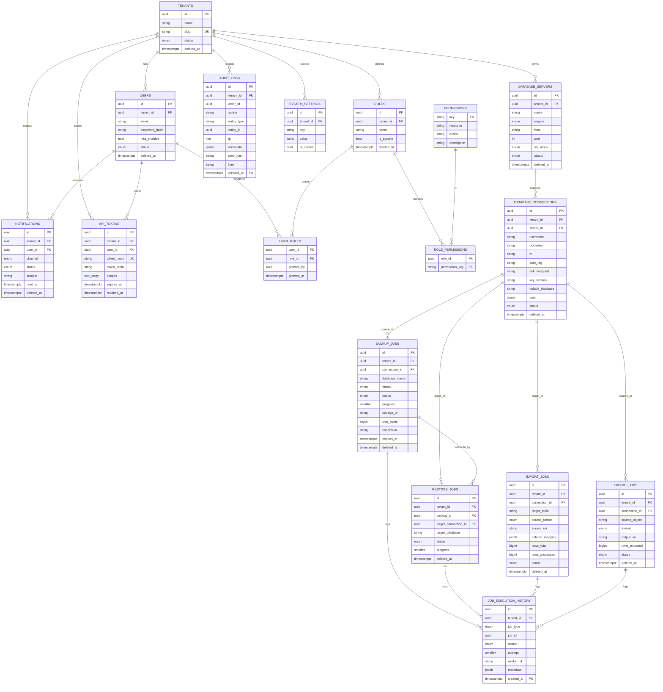

# PostgreSQL Database Schema — Design of Record

> **Engine:** PostgreSQL 14+ (uses `gen_random_uuid()`, partitioned-table FKs, `BRIN`).
> **Scope:** Physical schema for the Backup/Restore/Import/Export platform. Multi-tenant,
> RBAC, soft-delete, envelope-encrypted credentials, and an **audit log engineered for tens of
> millions of rows** via native range partitioning.
> **Companion:** `docs/SYSTEM_DESIGN.md` (architecture), `prisma/schema.prisma` (ORM view).

---

## Table of Contents
1. [Conventions](#1-conventions)
2. [Complete ERD](#2-complete-erd)
3. [Extensions, Enums & Shared Triggers](#3-extensions-enums--shared-triggers)
4. [Identity & RBAC](#4-identity--rbac-tables)
5. [Servers & Connections](#5-servers--connections)
6. [Job Tables](#6-job-tables)
7. [Job Execution History (partitioned)](#7-job-execution-history-partitioned)
8. [Audit Logs (partitioned, millions+)](#8-audit-logs-partitioned-for-millions)
9. [Notifications, Settings, API Tokens](#9-notifications-settings-api-tokens)
10. [Partitioning Strategy](#10-partitioning-strategy)
11. [Soft-Delete Strategy](#11-soft-delete-strategy)
12. [Foreign-Key & ON DELETE Matrix](#12-foreign-key--on-delete-matrix)
13. [Index Catalog](#13-index-catalog)

---

## 1. Conventions

| Concern | Convention |
|---|---|
| **Primary keys** | `uuid` with `DEFAULT gen_random_uuid()` — no hot integer sequence, shard-friendly, safe to expose |
| **Timestamps** | `timestamptz` (UTC), `created_at`/`updated_at` default `now()`; `updated_at` maintained by trigger |
| **Soft delete** | `deleted_at timestamptz NULL`; "alive" = `deleted_at IS NULL`. Uniqueness enforced by **partial** indexes |
| **Multi-tenancy** | Every tenant-scoped row carries `tenant_id`; composite indexes lead with `tenant_id`. RLS-ready (§11) |
| **Money/size** | `bigint` bytes; never floats |
| **Free-form** | `jsonb` for params/result/metadata/settings; validated at the app boundary (Zod) |
| **Naming** | `snake_case`, plural tables, `fk_`/`uq_`/`ix_`/`ck_` prefixes for constraints/indexes |
| **Enums** | Native `ENUM` for stable sets; widen with `ALTER TYPE ... ADD VALUE` (append-only) |

---

## 2. Complete ERD



> The four job tables are intentionally **separate** (not one polymorphic `jobs` table): each has a
> distinct payload shape and lifecycle, queries stay narrow, and indexes don't carry dead columns.
> `job_execution_history` unifies their **state-transition timeline** for a single operational view.

---

## 3. Extensions, Enums & Shared Triggers

```sql
CREATE EXTENSION IF NOT EXISTS pgcrypto;   -- gen_random_uuid(), digest()
CREATE EXTENSION IF NOT EXISTS btree_gin;  -- composite GIN where useful

-- ---- Enumerated types (stable sets; widen with ALTER TYPE ... ADD VALUE) ----
CREATE TYPE tenant_status   AS ENUM ('active','suspended');
CREATE TYPE user_status     AS ENUM ('active','invited','disabled');
CREATE TYPE db_engine       AS ENUM ('mysql','mariadb','postgres');
CREATE TYPE ssl_mode        AS ENUM ('disable','require','verify_full');
CREATE TYPE server_status   AS ENUM ('online','offline','unknown','degraded');
CREATE TYPE conn_status     AS ENUM ('active','disabled','invalid');
CREATE TYPE job_status       AS ENUM ('queued','running','succeeded','failed','cancelled');
CREATE TYPE backup_format    AS ENUM ('sql','custom','csv','xlsx');
CREATE TYPE import_format     AS ENUM ('csv','xlsx');
CREATE TYPE export_format     AS ENUM ('csv','xlsx','sql');
CREATE TYPE job_type          AS ENUM ('backup','restore','import','export');
CREATE TYPE notify_channel    AS ENUM ('inapp','email','webhook','slack');
CREATE TYPE notify_status     AS ENUM ('pending','sent','failed','read');

-- ---- updated_at maintenance ----
CREATE OR REPLACE FUNCTION set_updated_at() RETURNS trigger AS $$
BEGIN
  NEW.updated_at := now();
  RETURN NEW;
END $$ LANGUAGE plpgsql;
-- attach per table: CREATE TRIGGER trg_<t>_updated BEFORE UPDATE ON <t>
--                   FOR EACH ROW EXECUTE FUNCTION set_updated_at();
```

---

## 4. Identity & RBAC Tables

```sql
-- Tenant boundary (referenced by every scoped table; included for FK completeness).
CREATE TABLE tenants (
  id          uuid PRIMARY KEY DEFAULT gen_random_uuid(),
  name        text          NOT NULL,
  slug        citext        NOT NULL,
  status      tenant_status NOT NULL DEFAULT 'active',
  settings    jsonb         NOT NULL DEFAULT '{}'::jsonb,
  created_at  timestamptz   NOT NULL DEFAULT now(),
  updated_at  timestamptz   NOT NULL DEFAULT now(),
  deleted_at  timestamptz
);
CREATE UNIQUE INDEX uq_tenants_slug ON tenants (slug) WHERE deleted_at IS NULL;

CREATE TABLE users (
  id             uuid PRIMARY KEY DEFAULT gen_random_uuid(),
  tenant_id      uuid        NOT NULL REFERENCES tenants(id) ON DELETE CASCADE,
  email          citext      NOT NULL,
  name           text,
  password_hash  text        NOT NULL,
  mfa_enabled    boolean     NOT NULL DEFAULT false,
  mfa_secret     text,                         -- encrypted at rest by app
  status         user_status NOT NULL DEFAULT 'active',
  last_login_at  timestamptz,
  created_at     timestamptz NOT NULL DEFAULT now(),
  updated_at     timestamptz NOT NULL DEFAULT now(),
  deleted_at     timestamptz
);
-- One LIVE user per (tenant,email); a soft-deleted email can be re-used.
CREATE UNIQUE INDEX uq_users_tenant_email ON users (tenant_id, email) WHERE deleted_at IS NULL;
CREATE INDEX ix_users_tenant_status ON users (tenant_id, status) WHERE deleted_at IS NULL;

CREATE TABLE roles (
  id         uuid PRIMARY KEY DEFAULT gen_random_uuid(),
  tenant_id  uuid        NOT NULL REFERENCES tenants(id) ON DELETE CASCADE,
  name       text        NOT NULL,
  description text,
  is_system  boolean     NOT NULL DEFAULT false,   -- Owner/Admin/Operator/Viewer
  created_at timestamptz NOT NULL DEFAULT now(),
  updated_at timestamptz NOT NULL DEFAULT now(),
  deleted_at timestamptz
);
CREATE UNIQUE INDEX uq_roles_tenant_name ON roles (tenant_id, name) WHERE deleted_at IS NULL;

-- Global permission catalog (verb-on-resource). Seeded, rarely changes → no soft delete.
CREATE TABLE permissions (
  key         text PRIMARY KEY,                 -- e.g. 'backup:run'
  resource    text NOT NULL,                    -- 'backup'
  action      text NOT NULL,                    -- 'run'
  description text NOT NULL
);

-- Role ↔ Permission (required for RBAC; not in the original list but RBAC cannot work without it).
CREATE TABLE role_permissions (
  role_id        uuid NOT NULL REFERENCES roles(id)        ON DELETE CASCADE,
  permission_key text NOT NULL REFERENCES permissions(key) ON DELETE CASCADE,
  PRIMARY KEY (role_id, permission_key)
);

-- User ↔ Role (tenant-scoped binding).
CREATE TABLE user_roles (
  user_id    uuid NOT NULL REFERENCES users(id) ON DELETE CASCADE,
  role_id    uuid NOT NULL REFERENCES roles(id) ON DELETE CASCADE,
  granted_by uuid REFERENCES users(id) ON DELETE SET NULL,
  granted_at timestamptz NOT NULL DEFAULT now(),
  PRIMARY KEY (user_id, role_id)
);
CREATE INDEX ix_user_roles_role ON user_roles (role_id);
```

---

## 5. Servers & Connections

`database_servers` = the host/engine endpoint. `database_connections` = a credentialed login to that
server (envelope-encrypted; a server may have several — e.g. a read-only backup user and a restore
user). **No plaintext secret is ever stored.**

```sql
CREATE TABLE database_servers (
  id         uuid PRIMARY KEY DEFAULT gen_random_uuid(),
  tenant_id  uuid        NOT NULL REFERENCES tenants(id) ON DELETE CASCADE,
  name       text        NOT NULL,
  engine     db_engine   NOT NULL,
  host       text        NOT NULL,
  port       integer     NOT NULL,
  ssl_mode   ssl_mode    NOT NULL DEFAULT 'require',
  version    text,                              -- discovered server version
  status     server_status NOT NULL DEFAULT 'unknown',
  metadata   jsonb       NOT NULL DEFAULT '{}'::jsonb,
  created_at timestamptz NOT NULL DEFAULT now(),
  updated_at timestamptz NOT NULL DEFAULT now(),
  deleted_at timestamptz,
  CONSTRAINT ck_servers_port CHECK (port BETWEEN 1 AND 65535)
);
CREATE UNIQUE INDEX uq_servers_tenant_name ON database_servers (tenant_id, name) WHERE deleted_at IS NULL;
CREATE INDEX ix_servers_tenant ON database_servers (tenant_id) WHERE deleted_at IS NULL;

CREATE TABLE database_connections (
  id               uuid PRIMARY KEY DEFAULT gen_random_uuid(),
  tenant_id        uuid        NOT NULL REFERENCES tenants(id) ON DELETE CASCADE,
  server_id        uuid        NOT NULL REFERENCES database_servers(id) ON DELETE CASCADE,
  name             text        NOT NULL,
  username         text        NOT NULL,
  -- envelope encryption (AES-256-GCM payload + KEK-wrapped DEK)
  ciphertext       text        NOT NULL,
  iv               text        NOT NULL,
  auth_tag         text        NOT NULL,
  dek_wrapped      text        NOT NULL,
  key_version      text        NOT NULL DEFAULT 'v1',
  default_database text,
  pool             jsonb       NOT NULL DEFAULT '{"max":5}'::jsonb,
  status           conn_status NOT NULL DEFAULT 'active',
  last_tested_at   timestamptz,
  created_at       timestamptz NOT NULL DEFAULT now(),
  updated_at       timestamptz NOT NULL DEFAULT now(),
  deleted_at       timestamptz
);
CREATE UNIQUE INDEX uq_conn_server_name ON database_connections (server_id, name) WHERE deleted_at IS NULL;
CREATE INDEX ix_conn_tenant ON database_connections (tenant_id) WHERE deleted_at IS NULL;
CREATE INDEX ix_conn_server ON database_connections (server_id) WHERE deleted_at IS NULL;
```

---

## 6. Job Tables

All four share a common spine (`tenant_id`, `status`, `progress`, `created_by`, timing, `params`,
`result`, `error`, soft delete) plus job-specific columns.

```sql
CREATE TABLE backup_jobs (
  id             uuid PRIMARY KEY DEFAULT gen_random_uuid(),
  tenant_id      uuid        NOT NULL REFERENCES tenants(id) ON DELETE CASCADE,
  connection_id  uuid        NOT NULL REFERENCES database_connections(id) ON DELETE RESTRICT,
  created_by     uuid        REFERENCES users(id) ON DELETE SET NULL,
  schedule_id    uuid,                                   -- nullable; set if triggered by a schedule
  database_name  text        NOT NULL,
  format         backup_format NOT NULL DEFAULT 'sql',
  status         job_status  NOT NULL DEFAULT 'queued',
  progress       smallint    NOT NULL DEFAULT 0 CHECK (progress BETWEEN 0 AND 100),
  storage_uri    text,                                   -- s3://tenant/server/backup
  size_bytes     bigint      NOT NULL DEFAULT 0,
  checksum       text,
  params         jsonb       NOT NULL DEFAULT '{}'::jsonb,
  result         jsonb,
  error          text,
  expires_at     timestamptz,                            -- retention boundary
  started_at     timestamptz,
  finished_at    timestamptz,
  created_at     timestamptz NOT NULL DEFAULT now(),
  updated_at     timestamptz NOT NULL DEFAULT now(),
  deleted_at     timestamptz
);
CREATE INDEX ix_backup_tenant_status  ON backup_jobs (tenant_id, status)      WHERE deleted_at IS NULL;
CREATE INDEX ix_backup_tenant_created ON backup_jobs (tenant_id, created_at DESC);
CREATE INDEX ix_backup_connection     ON backup_jobs (connection_id);
CREATE INDEX ix_backup_active         ON backup_jobs (status) WHERE status IN ('queued','running');
CREATE INDEX ix_backup_expiry         ON backup_jobs (expires_at) WHERE expires_at IS NOT NULL AND deleted_at IS NULL;

CREATE TABLE restore_jobs (
  id                   uuid PRIMARY KEY DEFAULT gen_random_uuid(),
  tenant_id            uuid       NOT NULL REFERENCES tenants(id) ON DELETE CASCADE,
  backup_id            uuid       NOT NULL REFERENCES backup_jobs(id) ON DELETE RESTRICT,
  target_connection_id uuid       NOT NULL REFERENCES database_connections(id) ON DELETE RESTRICT,
  created_by           uuid       REFERENCES users(id) ON DELETE SET NULL,
  target_database      text       NOT NULL,
  drop_existing        boolean    NOT NULL DEFAULT false,
  status               job_status NOT NULL DEFAULT 'queued',
  progress             smallint   NOT NULL DEFAULT 0 CHECK (progress BETWEEN 0 AND 100),
  params               jsonb      NOT NULL DEFAULT '{}'::jsonb,
  result               jsonb,
  error                text,
  started_at           timestamptz,
  finished_at          timestamptz,
  created_at           timestamptz NOT NULL DEFAULT now(),
  updated_at           timestamptz NOT NULL DEFAULT now(),
  deleted_at           timestamptz
);
CREATE INDEX ix_restore_tenant_status  ON restore_jobs (tenant_id, status)      WHERE deleted_at IS NULL;
CREATE INDEX ix_restore_tenant_created ON restore_jobs (tenant_id, created_at DESC);
CREATE INDEX ix_restore_backup         ON restore_jobs (backup_id);

CREATE TABLE import_jobs (
  id             uuid PRIMARY KEY DEFAULT gen_random_uuid(),
  tenant_id      uuid          NOT NULL REFERENCES tenants(id) ON DELETE CASCADE,
  connection_id  uuid          NOT NULL REFERENCES database_connections(id) ON DELETE RESTRICT,
  created_by     uuid          REFERENCES users(id) ON DELETE SET NULL,
  target_table   text          NOT NULL,
  source_format  import_format NOT NULL,
  source_uri     text          NOT NULL,                -- s3 key of uploaded file
  column_mapping jsonb         NOT NULL DEFAULT '{}'::jsonb,
  rows_total     bigint        NOT NULL DEFAULT 0,
  rows_processed bigint        NOT NULL DEFAULT 0,
  rows_failed    bigint        NOT NULL DEFAULT 0,
  status         job_status    NOT NULL DEFAULT 'queued',
  progress       smallint      NOT NULL DEFAULT 0 CHECK (progress BETWEEN 0 AND 100),
  params         jsonb         NOT NULL DEFAULT '{}'::jsonb,
  result         jsonb,
  error          text,
  started_at     timestamptz,
  finished_at    timestamptz,
  created_at     timestamptz NOT NULL DEFAULT now(),
  updated_at     timestamptz NOT NULL DEFAULT now(),
  deleted_at     timestamptz
);
CREATE INDEX ix_import_tenant_status  ON import_jobs (tenant_id, status)      WHERE deleted_at IS NULL;
CREATE INDEX ix_import_tenant_created ON import_jobs (tenant_id, created_at DESC);
CREATE INDEX ix_import_connection     ON import_jobs (connection_id);

CREATE TABLE export_jobs (
  id             uuid PRIMARY KEY DEFAULT gen_random_uuid(),
  tenant_id      uuid          NOT NULL REFERENCES tenants(id) ON DELETE CASCADE,
  connection_id  uuid          NOT NULL REFERENCES database_connections(id) ON DELETE RESTRICT,
  created_by     uuid          REFERENCES users(id) ON DELETE SET NULL,
  source_object  text          NOT NULL,                -- table name or saved query id
  format         export_format NOT NULL DEFAULT 'csv',
  output_uri     text,                                  -- s3 key of produced artifact
  rows_exported  bigint        NOT NULL DEFAULT 0,
  status         job_status    NOT NULL DEFAULT 'queued',
  progress       smallint      NOT NULL DEFAULT 0 CHECK (progress BETWEEN 0 AND 100),
  params         jsonb         NOT NULL DEFAULT '{}'::jsonb,
  result         jsonb,
  error          text,
  started_at     timestamptz,
  finished_at    timestamptz,
  created_at     timestamptz NOT NULL DEFAULT now(),
  updated_at     timestamptz NOT NULL DEFAULT now(),
  deleted_at     timestamptz
);
CREATE INDEX ix_export_tenant_status  ON export_jobs (tenant_id, status)      WHERE deleted_at IS NULL;
CREATE INDEX ix_export_tenant_created ON export_jobs (tenant_id, created_at DESC);
CREATE INDEX ix_export_connection     ON export_jobs (connection_id);
```

---

## 7. Job Execution History (partitioned)

A unified, append-only timeline of state transitions and worker heartbeats across **all** job types.
`job_id` is a **polymorphic** reference (resolved by `job_type`) — no single FK target, so it is left
as a soft reference with a covering index. High write volume → **monthly RANGE partitions**.

```sql
CREATE TABLE job_execution_history (
  id          uuid        NOT NULL DEFAULT gen_random_uuid(),
  tenant_id   uuid        NOT NULL,
  job_type    job_type    NOT NULL,
  job_id      uuid        NOT NULL,            -- FK target depends on job_type (polymorphic)
  status      job_status  NOT NULL,
  attempt     smallint    NOT NULL DEFAULT 1,
  progress    smallint    CHECK (progress BETWEEN 0 AND 100),
  worker_id   text,
  message     text,
  metadata    jsonb       NOT NULL DEFAULT '{}'::jsonb,
  created_at  timestamptz NOT NULL DEFAULT now(),
  PRIMARY KEY (id, created_at)                 -- partition key must be in PK
) PARTITION BY RANGE (created_at);

-- Indexes are declared on the parent and inherited by every partition:
CREATE INDEX ix_jeh_job        ON job_execution_history (job_type, job_id, created_at DESC);
CREATE INDEX ix_jeh_tenant     ON job_execution_history (tenant_id, created_at DESC);
CREATE INDEX ix_jeh_created_brin ON job_execution_history USING brin (created_at);

-- Example partition + safety default (see §10 for automation):
CREATE TABLE job_execution_history_2026_06 PARTITION OF job_execution_history
  FOR VALUES FROM ('2026-06-01') TO ('2026-07-01');
CREATE TABLE job_execution_history_default PARTITION OF job_execution_history DEFAULT;
```

---

## 8. Audit Logs (partitioned, for millions+)

The audit table is the most write-heavy and longest-retained. Design choices that make tens of
millions of rows cheap:

- **Native RANGE partitioning by month** → queries prune to one/few partitions; retention is an
  `O(1)` `DETACH`/`DROP`, never a giant `DELETE`.
- **BRIN index on `created_at`** → a few KB covers a whole month of time-ordered inserts (vs. a
  multi-GB btree). Perfect for append-only + time-range reads.
- **Composite btree `(tenant_id, created_at DESC)`** for the common "this tenant's recent activity".
- **No FK on `actor_id`** (soft reference) → audit rows are **immutable and outlive** user deletion;
  removes a write-time lookup on the hottest table. `actor_email` is denormalized for the same reason.
- **Tamper-evident hash chain** (`prev_hash` → `hash`) per tenant; rows are append-only (no
  `UPDATE`/`DELETE` grant for the app role).

```sql
CREATE TABLE audit_logs (
  id          uuid        NOT NULL DEFAULT gen_random_uuid(),
  tenant_id   uuid        NOT NULL,
  actor_id    uuid,                              -- soft ref (no FK): survives user deletion
  actor_email citext,                            -- denormalized snapshot
  action      text        NOT NULL,              -- 'backup.run', 'user.role.grant', ...
  entity_type text,                              -- 'database_server', 'backup_job', ...
  entity_id   uuid,
  ip          inet,
  user_agent  text,
  metadata    jsonb       NOT NULL DEFAULT '{}'::jsonb,
  prev_hash   text,
  hash        text        NOT NULL,
  created_at  timestamptz NOT NULL DEFAULT now(),
  PRIMARY KEY (id, created_at)                   -- partition key must be in PK
) PARTITION BY RANGE (created_at);

-- Parent indexes (inherited by partitions):
CREATE INDEX ix_audit_tenant_time   ON audit_logs (tenant_id, created_at DESC);
CREATE INDEX ix_audit_actor         ON audit_logs (actor_id, created_at DESC);
CREATE INDEX ix_audit_action        ON audit_logs (tenant_id, action, created_at DESC);
CREATE INDEX ix_audit_entity        ON audit_logs (entity_type, entity_id);
CREATE INDEX ix_audit_created_brin  ON audit_logs USING brin (created_at) WITH (pages_per_range = 32);
CREATE INDEX ix_audit_meta_gin      ON audit_logs USING gin (metadata jsonb_path_ops);

-- Monthly partitions (automate via §10). Default catches stragglers so inserts never fail:
CREATE TABLE audit_logs_2026_06 PARTITION OF audit_logs
  FOR VALUES FROM ('2026-06-01') TO ('2026-07-01');
CREATE TABLE audit_logs_2026_07 PARTITION OF audit_logs
  FOR VALUES FROM ('2026-07-01') TO ('2026-08-01');
CREATE TABLE audit_logs_default PARTITION OF audit_logs DEFAULT;
```

> **Append-only enforcement:** grant the application role `INSERT, SELECT` only on `audit_logs`
> (no `UPDATE`/`DELETE`). Retention and partition maintenance run as a separate privileged role.

---

## 9. Notifications, Settings, API Tokens

```sql
CREATE TABLE notifications (
  id         uuid PRIMARY KEY DEFAULT gen_random_uuid(),
  tenant_id  uuid          NOT NULL REFERENCES tenants(id) ON DELETE CASCADE,
  user_id    uuid          NOT NULL REFERENCES users(id)   ON DELETE CASCADE,
  channel    notify_channel NOT NULL DEFAULT 'inapp',
  type       text          NOT NULL,                 -- 'backup.succeeded', ...
  subject    text          NOT NULL,
  body       text          NOT NULL,
  related_type text,                                 -- entity link for deep-linking
  related_id   uuid,
  status     notify_status NOT NULL DEFAULT 'pending',
  read_at    timestamptz,
  created_at timestamptz   NOT NULL DEFAULT now(),
  deleted_at timestamptz                              -- user dismissal (soft delete)
);
-- "unread inbox" hot path:
CREATE INDEX ix_notif_user_unread ON notifications (user_id, created_at DESC)
  WHERE read_at IS NULL AND deleted_at IS NULL;
CREATE INDEX ix_notif_user_time   ON notifications (user_id, created_at DESC) WHERE deleted_at IS NULL;
-- delivery worker pickup:
CREATE INDEX ix_notif_pending     ON notifications (status) WHERE status = 'pending';

-- Global (tenant_id NULL) or per-tenant key/value config.
CREATE TABLE system_settings (
  id          uuid PRIMARY KEY DEFAULT gen_random_uuid(),
  tenant_id   uuid        REFERENCES tenants(id) ON DELETE CASCADE,   -- NULL = global
  key         text        NOT NULL,
  value       jsonb       NOT NULL DEFAULT '{}'::jsonb,
  is_secret   boolean     NOT NULL DEFAULT false,
  description text,
  updated_by  uuid        REFERENCES users(id) ON DELETE SET NULL,
  created_at  timestamptz NOT NULL DEFAULT now(),
  updated_at  timestamptz NOT NULL DEFAULT now()
);
-- one row per key within a scope (global vs each tenant). COALESCE keeps the global slot unique.
CREATE UNIQUE INDEX uq_settings_scope_key
  ON system_settings (COALESCE(tenant_id, '00000000-0000-0000-0000-000000000000'::uuid), key);

CREATE TABLE api_tokens (
  id          uuid PRIMARY KEY DEFAULT gen_random_uuid(),
  tenant_id   uuid        NOT NULL REFERENCES tenants(id) ON DELETE CASCADE,
  user_id     uuid        REFERENCES users(id) ON DELETE CASCADE,    -- owner; NULL = service token
  name        text        NOT NULL,
  token_hash  text        NOT NULL,                  -- SHA-256 of the secret; raw shown once
  token_prefix text       NOT NULL,                  -- first 8 chars, for UI display
  scopes      text[]      NOT NULL DEFAULT '{}',     -- permission keys this token may use
  last_used_at timestamptz,
  expires_at  timestamptz,
  revoked_at  timestamptz,                            -- revocation = soft delete for tokens
  created_at  timestamptz NOT NULL DEFAULT now()
);
CREATE UNIQUE INDEX uq_tokens_hash    ON api_tokens (token_hash);
CREATE INDEX ix_tokens_tenant_active  ON api_tokens (tenant_id) WHERE revoked_at IS NULL;
CREATE INDEX ix_tokens_expiry         ON api_tokens (expires_at) WHERE revoked_at IS NULL;
```

---

## 10. Partitioning Strategy

**What is partitioned & why**

| Table | Scheme | Granularity | Rationale |
|---|---|---|---|
| `audit_logs` | RANGE on `created_at` | **monthly** | tens of millions of rows; prune by time, drop old months in O(1) |
| `job_execution_history` | RANGE on `created_at` | **monthly** | high-frequency heartbeat/transition writes |

Everything else stays a plain table — partitioning adds overhead and only pays off on large,
time-ordered, append-mostly tables.

**Why monthly:** a typical busy tenant fleet writes single-digit millions of audit rows/month. Monthly
keeps each partition in the tens-of-millions ceiling (fast index builds, fast `DROP`), while keeping
the partition count low enough that the planner's prune step stays cheap. Switch to **weekly** only if
a single month exceeds ~50–100M rows.

**Automation** — provision ahead, retire behind. Use `pg_partman` in production:

```sql
SELECT partman.create_parent(
  p_parent_table  => 'public.audit_logs',
  p_control       => 'created_at',
  p_type          => 'range',
  p_interval      => '1 month',
  p_premake       => 3            -- keep 3 future months ready
);
UPDATE partman.part_config
   SET retention = '24 months', retention_keep_table = false   -- DROP partitions older than 24m
 WHERE parent_table = 'public.audit_logs';
-- pg_partman's maintenance (pg_cron or external scheduler) creates/retires partitions automatically.
```

Manual fallback (run monthly by the scheduler service) when `pg_partman` isn't available:

```sql
CREATE OR REPLACE FUNCTION ensure_month_partition(p_parent regclass, p_month date)
RETURNS void AS $$
DECLARE
  start_d date := date_trunc('month', p_month);
  end_d   date := (date_trunc('month', p_month) + interval '1 month')::date;
  child   text := format('%s_%s', p_parent::text, to_char(start_d, 'YYYY_MM'));
BEGIN
  EXECUTE format(
    'CREATE TABLE IF NOT EXISTS %I PARTITION OF %s FOR VALUES FROM (%L) TO (%L)',
    child, p_parent::text, start_d, end_d);
END $$ LANGUAGE plpgsql;
```

**Retention / archival:** before dropping a partition past the retention window, the maintenance job
`DETACH`es it, copies it to cold storage (S3/Parquet via `COPY`), then `DROP`s — satisfying compliance
retention without bloating the hot DB. The `DEFAULT` partition is a safety net so a missing month never
fails an `INSERT`; an alert fires if the default ever receives rows.

---

## 11. Soft-Delete Strategy

**Model:** a nullable `deleted_at timestamptz`. `NULL` = alive; non-null = tombstoned at that instant.
Chosen over a boolean because it records **when** (audit value) and works directly in partial indexes.

**Which tables get it**

| Gets `deleted_at` | Rationale |
|---|---|
| `tenants`, `users`, `roles`, `database_servers`, `database_connections`, `backup_jobs`, `restore_jobs`, `import_jobs`, `export_jobs`, `notifications` | mutable entities a user can "remove" but that history/FKs still reference |
| `api_tokens` (via `revoked_at`) | revocation is the token's soft delete |
| **Excluded:** `audit_logs`, `job_execution_history` | **append-only** — never deleted individually; retired by partition drop |
| **Excluded:** `permissions`, `role_permissions`, `user_roles`, `system_settings` | catalog/junction/config — hard delete or upsert is correct |

**Enforcement rules**

1. **Uniqueness respects life:** every natural-key unique constraint is a **partial index**
   `... WHERE deleted_at IS NULL`, so a tombstoned row never blocks re-creating the same business key
   (e.g. re-adding a server with a previously used name).
2. **Reads filter by default:** all repository queries append `AND deleted_at IS NULL`. Expose
   convenience views to prevent leaks:
   ```sql
   CREATE VIEW users_active AS SELECT * FROM users WHERE deleted_at IS NULL;
   ```
3. **Referential safety:** child rows reference parents with `ON DELETE RESTRICT` so a *hard* delete
   can't orphan data; soft delete of a parent is an app-level cascade (mark children) or a guard that
   blocks soft-deleting a server with live connections.
4. **Hard purge path:** GDPR/"right to erasure" and tenant offboarding run a privileged hard `DELETE`;
   `ON DELETE CASCADE` from `tenants` makes tenant teardown a single transaction.
5. **RLS-ready:** when Postgres RLS is enabled, the tenant policy and a `deleted_at IS NULL` predicate
   are combined so isolation and soft-delete filtering are enforced in the database itself:
   ```sql
   ALTER TABLE users ENABLE ROW LEVEL SECURITY;
   CREATE POLICY tenant_isolation ON users USING (
     tenant_id = current_setting('app.tenant_id')::uuid AND deleted_at IS NULL
   );
   ```

---

## 12. Foreign-Key & ON DELETE Matrix

| Child → Parent | ON DELETE | Why |
|---|---|---|
| `users.tenant_id → tenants` | CASCADE | tenant teardown purges its users |
| `roles.tenant_id → tenants` | CASCADE | same |
| `role_permissions.role_id → roles` | CASCADE | junction dies with role |
| `role_permissions.permission_key → permissions` | CASCADE | junction dies with permission |
| `user_roles.user_id → users` | CASCADE | binding dies with user |
| `user_roles.role_id → roles` | CASCADE | binding dies with role |
| `user_roles.granted_by → users` | SET NULL | keep grant record if granter removed |
| `database_servers.tenant_id → tenants` | CASCADE | teardown |
| `database_connections.server_id → database_servers` | CASCADE | connections belong to a server |
| `*_jobs.tenant_id → tenants` | CASCADE | teardown |
| `*_jobs.connection_id → database_connections` | **RESTRICT** | can't delete a connection with job history |
| `restore_jobs.backup_id → backup_jobs` | **RESTRICT** | preserve provenance of a restore |
| `*_jobs.created_by → users` | SET NULL | keep job if creator removed |
| `notifications.user_id → users` | CASCADE | inbox dies with user |
| `system_settings.tenant_id → tenants` | CASCADE | per-tenant config dies with tenant |
| `api_tokens.user_id → users` | CASCADE | tokens die with owner |
| `audit_logs.actor_id` | **no FK** | immutable, must outlive the user; soft reference + denormalized email |
| `job_execution_history.job_id` | **no FK** | polymorphic across 4 job tables |

---

## 13. Index Catalog

**Pattern summary** (full DDL inline above):
- **Tenant-time** composite `(tenant_id, created_at DESC)` on every high-read table — powers paginated
  "recent X for this tenant".
- **Partial active** indexes `WHERE status IN ('queued','running')` and `WHERE deleted_at IS NULL` —
  small, hot, ideal for worker pickup and live dashboards.
- **Partial unique** indexes for all soft-deletable natural keys.
- **BRIN** on `created_at` for the two partitioned append-only tables — orders of magnitude smaller
  than btree at this volume.
- **GIN** on `audit_logs.metadata` (`jsonb_path_ops`) for ad-hoc forensic filters.
- **Worker/poller** partial indexes: `notifications(status) WHERE status='pending'`,
  `*_jobs(status) WHERE status IN ('queued','running')`, `api_tokens(expires_at) WHERE revoked_at IS NULL`.

> **Insert-cost guardrail:** the audit hot path deliberately runs **one btree + one BRIN + one GIN**;
> the BRIN and the absence of an `actor_id` FK keep write amplification low even at millions of rows.
> Add further audit indexes only behind measured query needs.

---

*Generated as the schema design of record. Apply via a Prisma migration or a raw SQL migration; keep
this document and `prisma/schema.prisma` in sync on every change.*
