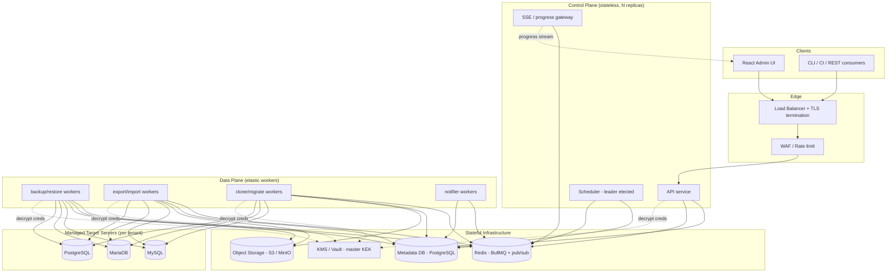
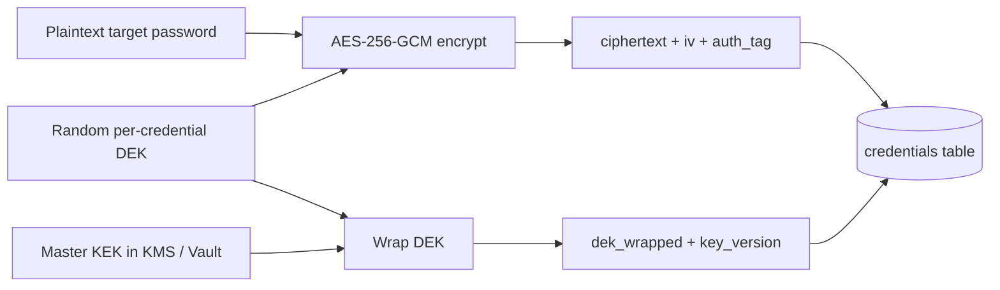
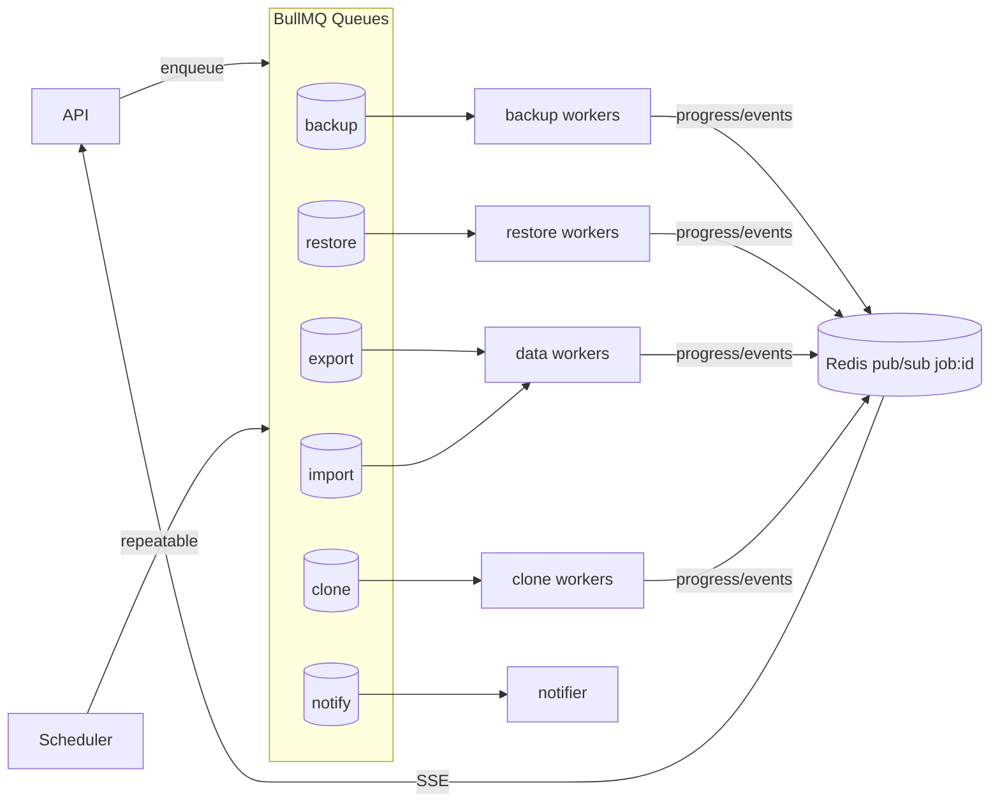
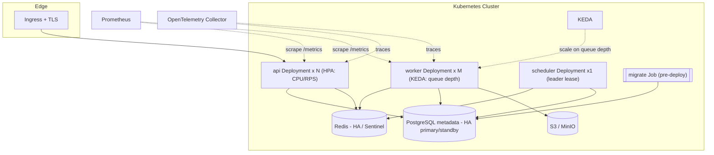
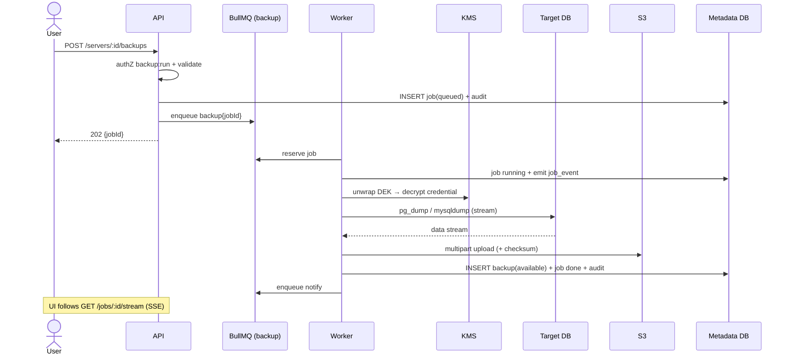
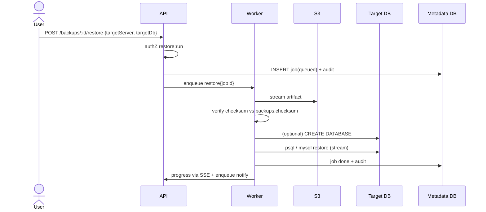
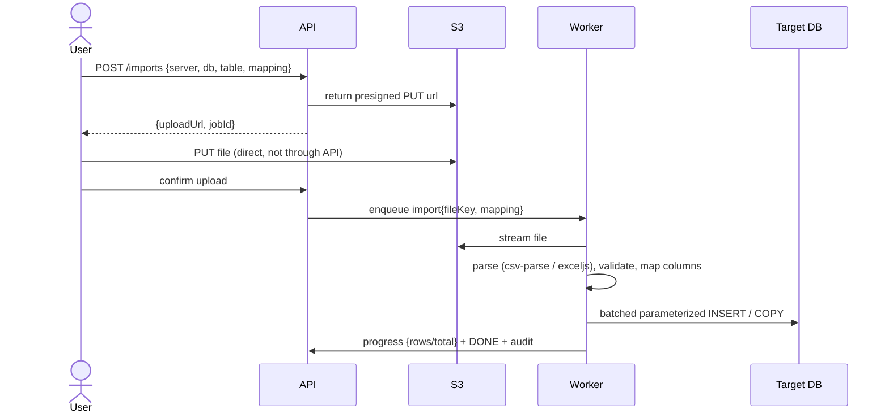
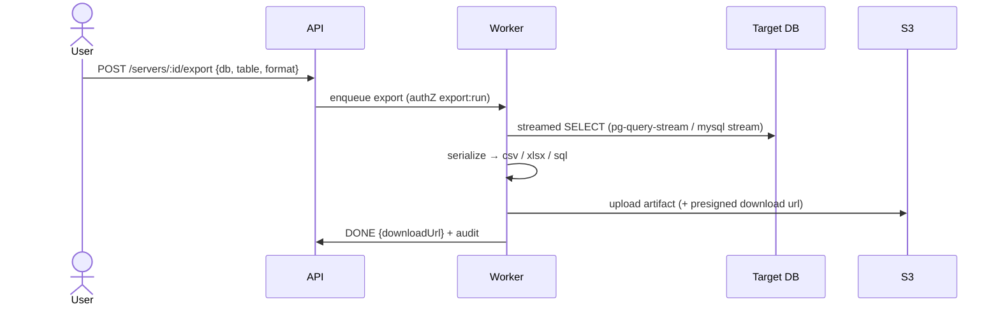
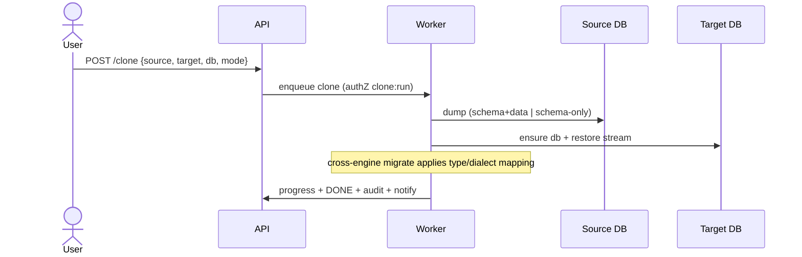
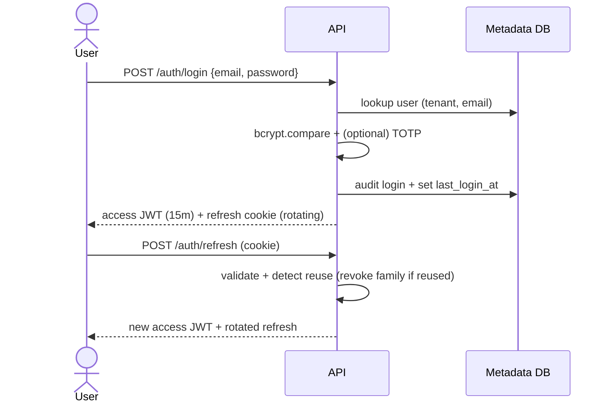

# Enterprise Database Migration, Backup, Restore, Import & Export Platform — System Design

> **Audience:** Staff/Principal engineers, SRE, and security reviewers.
> **Status:** Design of record. Complements `docs/ARCHITECTURE.md` (high‑level) with the deeper
> data model, threat model, scaling math, queue semantics, and operational design.
> **Scope:** Control‑plane + data‑plane platform that manages **many** MySQL / MariaDB / PostgreSQL
> servers and performs **Backup, Restore, Export, Import (CSV/Excel), Clone, Migrate** — multi‑tenant,
> RBAC, JWT, envelope‑encrypted credentials, background jobs, progress streaming, notifications, S3.

---

## Table of Contents
1. [High‑Level Architecture](#1-high-level-architecture)
2. [Database Schema](#2-database-schema)
3. [Service Breakdown](#3-service-breakdown)
4. [Security Architecture](#4-security-architecture)
5. [Queue Architecture](#5-queue-architecture)
6. [Audit Architecture](#6-audit-architecture)
7. [Deployment Architecture](#7-deployment-architecture)
8. [Sequence Diagrams](#8-sequence-diagrams)
9. [Non‑Functional Requirements & Capacity](#9-non-functional-requirements--capacity)

---

## 1. High‑Level Architecture

### 1.1 Design tenets
- **Separate control plane from data plane.** The API never streams database bytes. A 500 GB
  restore must never live in an HTTP request's memory or block an API replica.
- **Queue is the transport; the metadata DB is the system of record.** Redis can be lost and
  rebuilt; PostgreSQL holds durable truth (jobs, backups, audit, RBAC).
- **One image, many roles.** `server` / `worker` / `scheduler` ship from a single build and are
  selected by entrypoint, so CI stays simple while each role scales independently.
- **Stateless where it counts.** API and workers hold no session state → horizontal scale behind a
  load balancer with no sticky sessions (JWT carries identity).
- **Security first.** Envelope encryption for target credentials, tamper‑evident audit, least
  privilege, tenant isolation enforced centrally.

### 1.2 Component diagram



### 1.3 Data‑flow boundaries
| Plane | Touches DB bytes? | Scaling signal | Failure blast radius |
|---|---|---|---|
| API / SSE | No | RPS, CPU | One replica → load balancer reroutes |
| Workers | Yes (stream only) | Queue depth | One job retried on another worker |
| Scheduler | No | n/a (singleton) | Missed tick → recovered on next leader |
| Metadata DB | n/a | vertical + read replicas | Hard dependency → HA primary/standby |
| Redis | Transport only | memory/ops | Rebuildable; jobs re‑enqueued from DB state |

---

## 2. Database Schema

PostgreSQL is the metadata store. Canonical definition lives in `prisma/schema.prisma`; this section
is the normative design view. **Every tenant‑scoped row carries `tenant_id`** and isolation is enforced
in the data‑access layer (hardenable with Postgres RLS — see §4.6).

### 2.1 Entity‑Relationship model

```mermaid
erDiagram
    TENANT ||--o{ USER : has
    TENANT ||--o{ ROLE : defines
    TENANT ||--o{ DB_SERVER : owns
    TENANT ||--o{ JOB : owns
    TENANT ||--o{ BACKUP : owns
    TENANT ||--o{ SCHEDULE : owns
    TENANT ||--o{ AUDIT_LOG : records
    TENANT ||--o{ API_KEY : issues

    USER ||--o{ ROLE_ASSIGNMENT : bound_via
    ROLE ||--o{ ROLE_ASSIGNMENT : grants
    ROLE ||--o{ ROLE_PERMISSION : includes
    PERMISSION ||--o{ ROLE_PERMISSION : in
    USER ||--o{ NOTIFICATION : receives

    DB_SERVER ||--|| CREDENTIAL : secured_by
    DB_SERVER ||--o{ BACKUP : produces
    DB_SERVER ||--o{ SCHEDULE : scheduled_by

    SCHEDULE ||--o{ JOB : triggers
    JOB ||--o{ JOB_EVENT : emits
    JOB ||--o| BACKUP : creates

    TENANT { uuid id PK; string name; string slug UK; enum status; jsonb settings }
    USER { uuid id PK; uuid tenant_id FK; string email; string password_hash; bool mfa_enabled; enum status; datetime last_login_at }
    ROLE { uuid id PK; uuid tenant_id FK; string name; bool is_system }
    PERMISSION { string key PK; string description }
    ROLE_PERMISSION { uuid role_id FK; string permission_key FK }
    ROLE_ASSIGNMENT { uuid user_id FK; uuid role_id FK }
    DB_SERVER { uuid id PK; uuid tenant_id FK; enum engine; string host; int port; enum ssl_mode; jsonb metadata }
    CREDENTIAL { uuid id PK; uuid server_id FK_UK; string username; string ciphertext; string auth_tag; string iv; string dek_wrapped; string key_version }
    JOB { uuid id PK; uuid tenant_id FK; enum type; enum status; int progress; jsonb params; jsonb result; string error; uuid actor_id; uuid schedule_id }
    JOB_EVENT { uuid id PK; uuid job_id FK; string level; string message; int progress }
    BACKUP { uuid id PK; uuid tenant_id FK; uuid server_id FK; uuid job_id FK_UK; string database; enum format; enum status; bigint size; string storage_uri; string checksum; datetime expires_at }
    SCHEDULE { uuid id PK; uuid tenant_id FK; uuid server_id FK; string database; string cron; bool enabled; int retention; datetime last_run_at }
    AUDIT_LOG { uuid id PK; uuid tenant_id FK; uuid actor_id; string action; string target; jsonb meta; string ip; string prev_hash; string hash }
    NOTIFICATION { uuid id PK; uuid user_id FK; enum channel; string subject; string body; enum status; datetime read_at }
    API_KEY { uuid id PK; uuid tenant_id FK; string name; string hashed_key UK; datetime last_used_at; datetime revoked_at }
```

### 2.2 Table catalog

| Table | Purpose | Key columns / notes |
|---|---|---|
| `tenants` | Tenant boundary | `slug` unique; `settings` jsonb for per‑tenant policy (retention defaults, quotas) |
| `users` | Identity | `(tenant_id, email)` unique; `password_hash` bcrypt; `mfa_enabled` |
| `roles` | RBAC role | `(tenant_id, name)` unique; `is_system` for built‑ins |
| `permissions` | Global permission catalog | string `key` PK (e.g. `backup:run`) |
| `role_permissions` | Role→permission M:N | composite PK |
| `role_assignments` | User→role M:N (tenant‑scoped) | composite PK |
| `db_servers` | Managed targets | `engine`, `host`, `port`, `ssl_mode`; **no secrets here** |
| `credentials` | Envelope‑encrypted secrets | 1:1 with server; `ciphertext`+`auth_tag`+`iv`+`dek_wrapped`+`key_version` |
| `jobs` | Unit of async work | `type`, `status`, `progress`, `params`, `result`, `actor_id`, `schedule_id` |
| `job_events` | Progress/log timeline | append per job; drives SSE + history |
| `backups` | Backup artifacts catalog | `storage_uri`, `checksum`, `size`, `format`, `status`, `expires_at` |
| `schedules` | Cron‑driven backups | `cron`, `enabled`, `retention` (keep N) |
| `audit_logs` | Tamper‑evident audit | hash chain `prev_hash`→`hash`; append‑only |
| `notifications` | Per‑user delivery | `channel` (email/webhook/inapp), `status`, `read_at` |
| `api_keys` | Automation auth | `hashed_key` unique; `revoked_at` for rotation |

### 2.3 Enumerations
- `DbEngine`: `mysql | mariadb | postgres`
- `JobType`: `backup | restore | export | import | clone`
- `JobStatus`: `queued | running | done | failed | cancelled`
- `BackupFormat`: `sql | csv | xlsx` · `BackupStatus`: `pending | available | failed | deleted`
- `SslMode`: `disable | require | verify_full`
- `NotificationChannel`: `email | webhook | inapp` · `NotificationStatus`: `pending | sent | failed`
- `TenantStatus`: `active | suspended` · `UserStatus`: `active | invited | disabled`

### 2.4 Indexing & partitioning strategy
- **Hot read paths** are indexed by tenant + time: `jobs(tenant_id, status)`,
  `jobs(tenant_id, created_at)`, `backups(tenant_id, created_at)`, `audit_logs(tenant_id, created_at)`,
  `notifications(user_id, created_at)`.
- **High‑volume tables** (`audit_logs`, `job_events`) are candidates for **monthly range
  partitioning** on `created_at` to keep indexes small and enable cheap retention drops.
- `credentials.server_id` and `backups.job_id` are unique → enforce 1:1 invariants in the DB, not
  just app code.
- Foreign keys cascade on tenant delete (`onDelete: Cascade`) so tenant offboarding is a single
  transactional purge; `backups.job_id` uses `SetNull` so artifact records survive job pruning.

### 2.5 Migration / lifecycle
- Schema changes ship as **Prisma migrations** run as a pre‑deploy Kubernetes Job (`prisma migrate
  deploy`) — never on app boot.
- Backwards‑compatible expand/contract: add columns nullable → backfill → enforce, so rolling
  deploys never break a mixed‑version fleet.

---

## 3. Service Breakdown

### 3.1 Runtime services (one image, role by entrypoint)

| Service | Entrypoint | Responsibility | State | Scale on |
|---|---|---|---|---|
| **API** | `server.js` | REST, authN/Z, validation, enqueue, CRUD, SSE | stateless | RPS / CPU |
| **Worker** | `worker.js` | Execute job processors (backup/restore/export/import/clone), stream to/from S3, emit progress + audit | stateless | queue depth |
| **Scheduler** | `scheduler.js` | Materialize `schedules` → BullMQ repeatable jobs, enforce retention/pruning | leader‑elected singleton | n/a |
| **Notifier** | (worker role) | Consume `notify` queue → email/webhook/in‑app | stateless | queue depth |

### 3.2 Internal module boundaries (within the codebase)
`auth` · `rbac` · `tenancy` · `servers` · `credentials (crypto)` · `db/adapters` (mysql, postgres) ·
`backups` · `restore` · `export` · `import` · `clone` · `schedules` · `jobs` · `queue` · `storage (s3)` ·
`audit` · `notifications`. These map to `src/modules/*`, `src/db/adapters/*`, and
`src/worker/processors/*` in the implementation.

### 3.3 Database adapter abstraction
A single `DbAdapter` interface isolates engine specifics so processors stay engine‑agnostic:

```
interface DbAdapter {
  testConnection(): Promise<void>
  listDatabases(): Promise<string[]>
  listTables(db): Promise<string[]>
  dump(db, opts): Readable           // mysqldump / pg_dump streamed
  restore(db, stream, opts): Promise // mysql / psql / pg_restore
  exportTable(db, table, format): Readable
  importStream(db, table, stream, mapping): Promise
}
```
- **MySQL/MariaDB** share one adapter (wire‑compatible) using `mysqldump`/`mysql` + `mysql2` driver.
- **PostgreSQL** uses `pg_dump`/`pg_restore`/`psql` + `pg` + `pg-query-stream`.
- **No shell string interpolation** — external tools are invoked with **argument arrays** only.

### 3.4 Why a modular monolith (not microservices) for v1
Each operation shares the same data model, auth, and queue. Splitting into network‑separated
microservices would add latency and distributed‑transaction complexity for no isolation benefit —
the meaningful isolation boundary is **control plane vs data plane**, which we already have. The
codebase keeps **hard module boundaries** so any module can be extracted later if a scaling or team
boundary demands it.

---

## 4. Security Architecture

### 4.1 Authentication
- **JWT access tokens**, short‑lived (~15 min), signed `RS256`/`HS256`, carrying
  `{ sub, tenantId, roles?, jti }`. No server‑side session lookup on the hot path.
- **Refresh tokens**: opaque, rotating, `httpOnly`+`Secure`+`SameSite` cookie, ~7 days, server‑side
  revocable. Rotation detects token theft (reuse → revoke family).
- **Passwords**: bcrypt (cost ≥ 12). **API keys**: random, stored only as a hash (`hashed_key`),
  shown once, revocable via `revoked_at`.
- **MFA** (`mfa_enabled`) optional TOTP at login.

### 4.2 Authorization (RBAC)
- Permission keys are verbs on resources: `server:create|read|update|delete`, `backup:run|read`,
  `restore:run`, `export:run`, `import:run`, `clone:run`, `schedule:manage`, `job:read`,
  `user:manage`, `audit:read`.
- **Roles bundle permissions**; `role_assignments` bind users→roles **within a tenant**. Built‑in
  roles: **Owner, Admin, Operator, Viewer**.
- Every request resolves `(tenant, user, permissions)` once; routes guard with
  `requirePermission('backup:run')`. Authorization is **deny by default**.

### 4.3 Credential storage — envelope encryption
Target DB passwords are the crown jewels. They are **never** stored in plaintext and **never**
returned by the API.


- **Per‑credential DEK** (Data Encryption Key) encrypts the password with AES‑256‑GCM (`iv`,
  `auth_tag` stored alongside `ciphertext`).
- DEK is **wrapped by a KEK** (Key Encryption Key) held outside the DB (KMS/Vault/env). `key_version`
  enables **KEK rotation** by re‑wrapping DEKs — plaintext is never touched.
- Plaintext exists only transiently in **worker** memory during a dump/restore; scrubbed after use,
  never logged.

### 4.4 Transport & network
- TLS everywhere (client→LB, internal mTLS optional). Target connections honor `ssl_mode`
  (`disable | require | verify_full`).
- Workers should run in an egress‑restricted subnet; target DBs reachable via allow‑listed routes /
  private peering, not the public internet.

### 4.5 Application hardening
- Helmet security headers, strict CORS allowlist, `express-rate-limit` on auth + mutating routes.
- **Zod** schema validation at every boundary; parameterized queries only; argument‑array process
  execution (no shell injection surface).
- Least‑privilege recommendation: dedicated DB role per target with only the grants the operation
  needs (e.g., `SELECT, LOCK TABLES` for backup; `CREATE, INSERT` for restore).

### 4.6 Tenant isolation
- `tenant_id` filter injected centrally in the data‑access layer; cross‑tenant reads are impossible
  through normal code paths.
- **Defense in depth:** enable **PostgreSQL Row‑Level Security** with `current_setting('app.tenant_id')`
  so even a raw query cannot escape the tenant boundary.
- S3 keys are tenant‑prefixed (`/{tenantId}/{serverId}/{backupId}`); IAM/bucket policy scoping per
  tenant for hostile multi‑tenancy.

### 4.7 Threat model (STRIDE summary)
| Threat | Vector | Mitigation |
|---|---|---|
| **Spoofing** | Stolen token | Short JWT TTL, refresh rotation + reuse detection, MFA |
| **Tampering** | Altered audit / backup | Hash‑chained audit (§6), backup `checksum` verified on restore |
| **Repudiation** | "I didn't do it" | Append‑only audit with actor, IP, timestamp |
| **Information disclosure** | Credential leak | Envelope encryption, KEK outside DB, never logged/returned |
| **DoS** | Job flood / huge file | Rate limits, per‑tenant concurrency quotas, file size caps, queue backpressure |
| **Elevation of privilege** | Cross‑tenant / RBAC bypass | Deny‑by‑default RBAC, central tenant filter, optional RLS |

---

## 5. Queue Architecture

BullMQ on Redis. **One queue per job class** so each scales, retries, and fails independently.



### 5.1 Delivery semantics
- **At‑least‑once** delivery → all processors are **idempotent**. Idempotency key = `jobId`; S3
  artifacts are **content‑addressed** (checksum) so a retried upload overwrites the same key safely.
- **Retries** with exponential backoff (e.g., 3 attempts, 5s→25s→125s). Exhausted jobs move to a
  **dead‑letter** set and mark `jobs.status = failed` with `error`.
- **Heartbeats / stalled detection**: long jobs renew their lock; a crashed worker's job is detected
  as stalled and re‑queued onto a healthy worker.
- **Cancellation**: API sets a cancel flag (`jobs.status = cancelled` + Redis signal); the processor
  checks it at chunk boundaries and aborts the underlying process cleanly.

### 5.2 Progress & streaming
- Workers publish `{ progress, message }` to Redis channel `job:{id}`; rows also persisted to
  `job_events` for durable history.
- API exposes `GET /jobs/:id/stream` (**Server‑Sent Events**) — subscribes to the channel and relays
  to the UI. SSE chosen over WebSockets: one‑way, proxy‑friendly, auto‑reconnect.

### 5.3 Fairness & quotas
- Per‑tenant concurrency caps prevent one tenant from starving others (token bucket on enqueue or
  BullMQ group concurrency).
- Worker concurrency is tuned per class: backup/restore are IO/process‑bound (low concurrency, high
  memory headroom); notify is light (high concurrency).

---

## 6. Audit Architecture

Every mutating action writes an `audit_log` row. To make tampering **detectable**, logs form a
**per‑tenant hash chain**:

```
hash = SHA256( prev_hash || canonical_json(entry) )
```

```mermaid
sequenceDiagram
    participant U as User
    participant API
    participant DB as Metadata DB
    U->>API: POST /servers (create)
    API->>API: authZ + validate
    API->>DB: BEGIN
    API->>DB: INSERT db_server
    API->>DB: SELECT last audit hash (tenant) FOR UPDATE
    API->>DB: INSERT audit_log {action, actor, ip, prev_hash, hash}
    API->>DB: COMMIT
    API-->>U: 201 Created
    Note over DB: audit row chained to previous; break = detectable
```

- **Written in the same transaction** as the mutation for synchronous actions; for async jobs, each
  lifecycle transition (`queued→running→done/failed`) emits an audit entry.
- **Append‑only**: the app DB role has no `UPDATE`/`DELETE` grant on `audit_logs`. Retention drops
  happen via partition detach by a separate privileged role.
- **Verification job** periodically re‑walks the chain per tenant and alerts on any mismatch.
- **What's audited:** auth events (login/refresh/logout/lockout), RBAC changes, server & credential
  CRUD, every job lifecycle transition, restores, exports/imports, schedule changes, backup
  downloads, API‑key issue/revoke. Exportable to SIEM.

---

## 7. Deployment Architecture



- **Single image, three Deployments** (`api`, `worker`, `scheduler`) selected by command. Independent
  replica counts and autoscalers.
- **Docker Compose** for single‑host/dev (in repo); **Kubernetes + Helm** for production.
- **Health probes**: `/health` (liveness), `/ready` (readiness: DB + Redis reachable). Workers expose
  readiness based on queue connectivity.
- **Autoscaling**: API on CPU/RPS (HPA); workers on **queue depth** (KEDA) so a backlog of large
  backups scales the data plane without touching the API.
- **Config**: 12‑factor env vars; secrets from KMS/Vault/Secret manager (see `.env.example`).
  Migrations run as a **pre‑deploy Job**, gated before traffic shifts.
- **Observability**: structured JSON logs (pino), Prometheus metrics (queue depth, job duration,
  failure rate, S3 throughput), OpenTelemetry traces across API→queue→worker.
- **Rollout**: rolling deploy with expand/contract migrations; workers drain in‑flight jobs on
  `SIGTERM` (finish or re‑queue) before exit.

---

## 8. Sequence Diagrams

### 8.1 On‑demand / scheduled Backup


### 8.2 Restore (with integrity check)


### 8.3 Import CSV / Excel (presigned upload)


### 8.4 Export table (CSV / Excel / SQL)


### 8.5 Clone / Migrate (server → server)


### 8.6 Auth: login + refresh rotation


---

## 9. Non‑Functional Requirements & Capacity

### 9.1 Targets
| Dimension | Target |
|---|---|
| API availability | 99.9% (control plane), workers degrade gracefully |
| API p95 latency (CRUD) | < 200 ms (data never flows through API) |
| Backup throughput | bounded by target DB + S3 multipart; ~hundreds of MB/s per worker |
| Job durability | survives worker crash (at‑least‑once + re‑queue) |
| RPO / RTO | RPO = schedule interval; RTO = restore duration (size‑bound) |

### 9.2 Scaling math (illustration)
- If a tenant runs 200 backups/night in a 4‑hour window and each averages 6 min wall time, peak
  concurrency ≈ `200 × 6 / 240 = 5` concurrent jobs. With worker concurrency 2, that's ~3 worker
  pods. KEDA scales on the actual `backup` queue depth so this is automatic.
- Metadata DB load is dominated by `audit_logs` + `job_events` inserts → partition by month, archive
  cold partitions to S3/Glacier.

### 9.3 Backpressure & limits
- Per‑tenant: max concurrent jobs, max backup size, max import file size, monthly storage quota
  (from `tenants.settings`).
- Global: queue length thresholds trigger autoscale and, beyond a ceiling, `429` on enqueue with
  `Retry-After`.

### 9.4 Disaster recovery
- Metadata DB: PITR + cross‑region standby. Redis: rebuildable (re‑enqueue from DB job state).
- S3: versioning + cross‑region replication + object lock for ransomware resistance on backups.
- **Restore drills**: scheduled automated restore of a sample backup into a scratch target to prove
  RTO and artifact integrity.

---

*Companion documents:* `docs/ARCHITECTURE.md` (high‑level overview & REST contract),
`prisma/schema.prisma` (canonical schema), `docker-compose.yml` (local topology).
